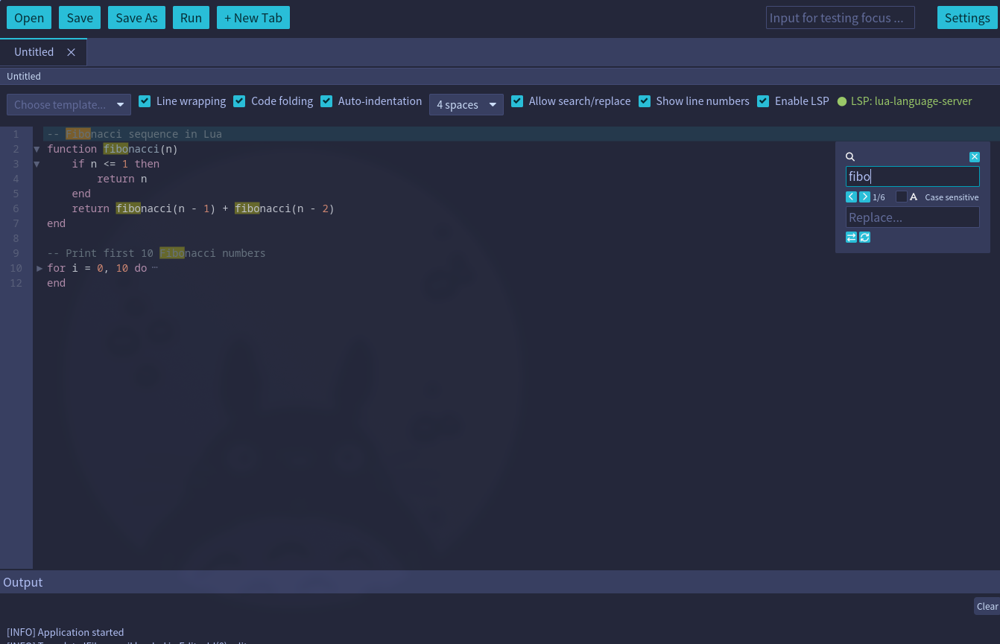
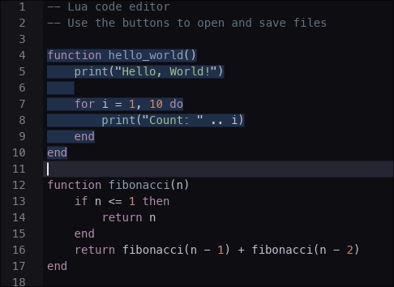
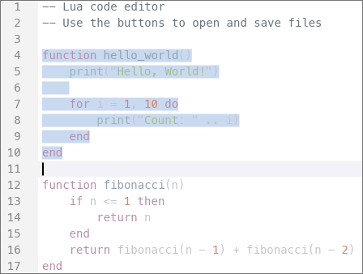

<div align="center">


# Iced Code Editor

A high-performance, canvas-based code editor widget for [Iced](https://github.com/iced-rs/iced).

[](https://crates.io/crates/iced-code-editor)
[](https://docs.rs/iced-code-editor)
[](https://github.com/LuDog71FR/iced-code-editor/blob/main/LICENSE)
[](https://crates.io/crates/iced-code-editor)
[](https://github.com/LuDog71FR/iced-code-editor/actions)

</div>

## Overview

This crate provides a fully-featured code editor widget with syntax highlighting, line numbers, text selection, and comprehensive keyboard navigation for the Iced GUI framework.

Screenshot of the demo application:



## Features

- **Syntax highlighting** for multiple programming languages via [syntect](https://github.com/trishume/syntect)
- **Line numbers** with styled gutter
- **Text selection** via mouse drag and keyboard shortcuts
- **Clipboard operations** (copy, paste)
- **Undo/Redo** with smart command grouping and configurable history
- **Custom scrollbars** with themed styling
- **Focus management** for multiple editors
- **Native Iced theme support** - Automatically adapts to all 23+ built-in Iced themes
- **Line wrapping** to split long lines
- **High performance** canvas-based rendering
- **Search and replace** text
- **Language Server Protocol** (LSP) support
- **Auto indentation** with custom indent style
- **Multiple cursors** for simultaneous editing at multiple positions

## Planned features

- [ ] Collapse/expand blocks
- [ ] Minimap

## Quick Start

Add this to your `Cargo.toml`:

```toml
[dependencies]
iced = "0.14"
iced-code-editor = "0.3"
```

### Basic Example

Here's a minimal example to integrate the code editor into your Iced application:

> **Note:** `CodeEditor` does not automatically lose focus when another widget is clicked.
> You must call `editor.lose_focus()` whenever another interactive widget is activated.
> The pattern below uses `mouse_area` to detect clicks on sibling widgets.

```rust
use iced::widget::{column, container, mouse_area, text_input};
use iced::{Element, Task};
use iced_code_editor::{CodeEditor, Message as EditorMessage};

struct MyApp {
    editor: CodeEditor,
    input_value: String,
}

#[derive(Debug, Clone)]
enum Message {
    EditorEvent(EditorMessage),
    InputChanged(String),
    InputClicked,
}

impl Default for MyApp {
    fn default() -> Self {
        let code = r#"fn main() {
    println!("Hello, world!");
}
"#;

        Self {
            editor: CodeEditor::new(code, "rust"),
            input_value: String::new(),
        }
    }
}

impl MyApp {
    fn update(&mut self, message: Message) -> Task<Message> {
        match message {
            Message::EditorEvent(event) => {
                self.editor.update(&event).map(Message::EditorEvent)
            }
            Message::InputChanged(value) => {
                self.input_value = value;
                self.editor.lose_focus(); // required: transfer focus away from editor
                Task::none()
            }
            Message::InputClicked => {
                self.editor.lose_focus(); // required: transfer focus away from editor
                Task::none()
            }
        }
    }

    fn view(&self) -> Element<'_, Message> {
        let input = mouse_area(
            text_input("Type something...", &self.input_value)
                .on_input(Message::InputChanged)
                .padding(8),
        )
        .on_press(Message::InputClicked); // detect click to trigger lose_focus

        container(
            column![input, self.editor.view().map(Message::EditorEvent)]
                .spacing(10)
                .height(iced::Fill),
        )
        .padding(20)
        .into()
    }
}

fn main() -> iced::Result {
    iced::run(MyApp::update, MyApp::view)
}
```

## Keyboard Shortcuts

The editor supports a comprehensive set of keyboard shortcuts:

### Navigation

| Shortcut                               | Action                        |
| -------------------------------------- | ----------------------------- |
| **Arrow Keys** (Up, Down, Left, Right) | Move cursor                   |
| **Shift + Arrows**                     | Move cursor with selection    |
| **Home** / **End**                     | Jump to start/end of line     |
| **Shift + Home** / **Shift + End**     | Select to start/end of line   |
| **Ctrl + Home** / **Ctrl + End**       | Jump to start/end of document |
| **Page Up** / **Page Down**            | Scroll one page up/down       |

### Editing

| Shortcut           | Action                                                                   |
| ------------------ | ------------------------------------------------------------------------ |
| **Backspace**      | Delete character before cursor (or delete selection if text is selected) |
| **Delete**         | Delete character after cursor (or delete selection if text is selected)  |
| **Shift + Delete** | Delete selected text (same as Delete when selection exists)              |
| **Enter**          | Insert new line                                                          |
| **Tab**            | Insert indent                                                            |

### Clipboard

| Shortcut                           | Action               |
| ---------------------------------- | -------------------- |
| **Ctrl + C** or **Ctrl + Insert**  | Copy selected text   |
| **Ctrl + V** or **Shift + Insert** | Paste from clipboard |

### Undo/Redo

| Shortcut     | Action                     |
| ------------ | -------------------------- |
| **Ctrl + Z** | Undo last operation        |
| **Ctrl + Y** | Redo last undone operation |

The editor features smart command grouping - consecutive typing is grouped into single undo operations, while navigation or deletion actions create separate undo points.

### Multiple Cursors

| Shortcut              | Action                                          |
| --------------------- | ----------------------------------------------- |
| **Alt + Click**       | Add a cursor at the clicked position             |
| **Ctrl + Alt + Up**   | Add a cursor on the line above                   |
| **Ctrl + Alt + Down** | Add a cursor on the line below                   |
| **Ctrl + D**          | Select the next occurrence of the current word/selection |
| **Escape**            | Collapse all cursors back to one (when search dialog is closed) |

All editing operations (typing, backspace, delete, enter, tab, paste) apply simultaneously to every cursor. Copy with multiple selections joins all selected texts with newlines. Paste with the same number of clipboard lines as cursors pastes one line per cursor.

### Search and Replace

| Shortcut          | Action                         |
| ----------------- | ------------------------------ |
| **Ctrl + F**      | Open search dialog             |
| **Ctrl + H**      | Open search and replace dialog |
| **F3**            | Find next match                |
| **Shift + F3**    | Find previous match            |
| **Escape**        | Close search dialog            |

### LSP Completion

These shortcuts are active only when the LSP completion menu is visible:

| Shortcut                          | Action                              |
| --------------------------------- | ----------------------------------- |
| **Arrow Up**                      | Navigate to previous completion item |
| **Arrow Down**                    | Navigate to next completion item    |
| **Enter**                         | Confirm and apply selected completion |
| **Escape**                        | Close completion menu               |
| **Arrow Left** / **Arrow Right**  | Clear completion menu               |

## Usage Examples

### Changing Themes

The editor uses **TokyoNightStorm** as the default theme. It automatically adapts to any Iced theme. All 23+ built-in Iced themes are supported:

```rust
use iced_code_editor::theme;

// Apply any built-in Iced theme
editor.set_theme(theme::from_iced_theme(&iced::Theme::TokyoNightStorm));
editor.set_theme(theme::from_iced_theme(&iced::Theme::Dracula));
editor.set_theme(theme::from_iced_theme(&iced::Theme::Nord));
editor.set_theme(theme::from_iced_theme(&iced::Theme::CatppuccinMocha));
editor.set_theme(theme::from_iced_theme(&iced::Theme::GruvboxDark));

// Or use any theme from Theme::ALL
for theme in iced::Theme::ALL {
    editor.set_theme(theme::from_iced_theme(theme));
}
```

### Getting and Setting Content

```rust
// Get current content
let content = editor.content();

// Check if content has been modified
if editor.is_modified() {
    println!("Editor has unsaved changes");
}

// Mark content as saved (e.g., after saving to file)
editor.mark_saved();
```

### Enable/disable search/replace

The search/replace functionality is **enabled by default**. It can be toggled on or off. When disabled, search shortcuts (Ctrl+F, Ctrl+H, F3) are ignored and the search dialog is hidden:

```rust
// Disable search/replace functionality
editor.set_search_replace_enabled(false);

// Or use builder pattern during initialization
let editor = CodeEditor::new("code", "rs")
    .with_search_replace_enabled(false);

// Check current state
if editor.search_replace_enabled() {
    println!("Search and replace is available");
}
```

This is useful for read-only editors or when you want to provide your own search interface.

### Open search/replace from your own buttons

Besides keyboard shortcuts, you can open or close the dialogs via API:

```rust
// Open search dialog (same as Ctrl+F)
let task = editor.open_search_dialog();

// Open search+replace dialog (same as Ctrl+H)
let task = editor.open_search_replace_dialog();

// Close dialog (same as Esc)
let task = editor.close_search_dialog();
```

Return these tasks from your app `update` function after mapping to your message type.

### Enable/disable line wrapping

Line wrapping is **enabled by default** at viewport width. Long lines can be wrapped automatically at the viewport width or at a fixed column:

```rust
// Enable line wrapping at viewport width
editor.set_wrap_enabled(true);

// Wrap at a fixed column (e.g., 80 characters)
let editor = CodeEditor::new("code", "rs")
    .with_wrap_enabled(true)
    .with_wrap_column(Some(80));

// Disable wrapping
editor.set_wrap_enabled(false);

// Check current state
if editor.wrap_enabled() {
    println!("Line wrapping is active");
}
```

When enabled, wrapped lines show a continuation indicator (↪) in the line number gutter.

### Enable/disable line numbers

Line numbers are **displayed by default**. They can be hidden to maximize space for code:

```rust
// Hide line numbers
editor.set_line_numbers_enabled(false);

// Or use builder pattern during initialization
let editor = CodeEditor::new("code", "rs")
    .with_line_numbers_enabled(false);

// Show line numbers (default behavior)
editor.set_line_numbers_enabled(true);

// Check current state
if editor.line_numbers_enabled() {
    println!("Line numbers are visible");
}
```

When disabled, the gutter is completely removed (0px width), providing more horizontal space for code display.

### Indentation

Auto-indentation is **enabled by default**: pressing Enter copies the leading whitespace of the current line to the new line. The indentation style (spaces or tab) is **4 spaces by default** and controls what is inserted when pressing Tab.

```rust
// Disable auto-indentation on Enter
editor.set_auto_indent_enabled(false);

// Check current state
if editor.auto_indent_enabled() {
    println!("Auto-indentation is active");
}
```

```rust
use iced_code_editor::IndentStyle;

// Use 2 spaces per indent level
editor.set_indent_style(IndentStyle::Spaces(2));

// Use tabs instead of spaces
editor.set_indent_style(IndentStyle::Tab);

// Restore the default (4 spaces)
editor.set_indent_style(IndentStyle::Spaces(4));

// Check current style
match editor.indent_style() {
    IndentStyle::Spaces(n) => println!("Indenting with {n} spaces"),
    IndentStyle::Tab => println!("Indenting with tabs"),
}
```

Available styles via `IndentStyle::ALL`: `Spaces(2)`, `Spaces(4)`, `Spaces(8)`, `Tab`.

### Language Server Protocol (LSP)

LSP support provides hover documentation, auto-completion, and go-to-definition. It requires the `lsp-process` feature (not available on WASM):

```toml
[dependencies]
iced-code-editor = { version = "0.3", features = ["lsp-process"] }
```

#### Enable/disable LSP on an editor

```rust
// Enable LSP (attach a client and open the document)
editor.set_lsp_enabled(true);

// Disable LSP (detach the client)
editor.set_lsp_enabled(false);
```

#### Connecting an LSP server

```rust
use std::sync::mpsc;
use iced_code_editor::{LspProcessClient, LspEvent, LspDocument};

// Create a channel to receive LSP events
let (tx, rx) = mpsc::channel::<LspEvent>();

// Start the server (e.g., lua-language-server)
let client = LspProcessClient::new_with_server(
    "file:///path/to/project",
    tx,
    "lua-language-server",
)?;

// Attach the client to an editor with a document URI
editor.attach_lsp(
    Box::new(client),
    LspDocument::new("file:///path/to/file.lua", "lua"),
);
```

#### Rendering the overlay (hover + completion)

Use `LspOverlayState` to hold display state and `view_lsp_overlay` to render it:

```rust
use iced_code_editor::{LspOverlayState, LspOverlayMessage, view_lsp_overlay};

struct App {
    editor: CodeEditor,
    overlay: LspOverlayState,
}

#[derive(Clone)]
enum Message {
    LspOverlay(LspOverlayMessage),
    // ...
}

fn view(app: &App) -> Element<'_, Message> {
    // Stack the overlay on top of the editor
    stack![
        app.editor.view().map(Message::EditorEvent),
        view_lsp_overlay(
            &app.overlay,
            &app.editor,
            &app.theme,
            14.0,    // font size
            20.0,    // line height
            Message::LspOverlay,
        ),
    ].into()
}
```

Poll `LspEvent`s from the channel on each tick and update the overlay state:

```rust
// On LspEvent::Hover
overlay.show_hover(text);

// On LspEvent::Completion
overlay.set_completions(items, cursor_position);
```

#### Supported servers

Out of the box, the following servers are supported (the binary must be on `$PATH`):

| Server key              | Language     |
| ----------------------- | ------------ |
| `lua-language-server`   | Lua          |
| `rust-analyzer`         | Rust         |
| `pylsp`                 | Python       |
| `clangd`                | C / C++      |
| `typescript-language-server` | JS / TS |

### Changing font

The default font of the editor is `iced::Font::MONOSPACE`. It can be changed with one of the default `iced` font or by loading a specific font:

```rust
let font = iced::font::Family::SansSerif;
editor.set_font(font);
```

> The editor support CJK font.

The default font size is **14px**. It can be changed:

```rust
editor.set_font_size(12.0, true);
```

## Themes

The editor natively supports all built-in Iced themes with automatic color adaptation.

Each theme automatically provides:

- Optimized background and foreground colors
- Adaptive gutter (line numbers) styling
- Appropriate text selection colors
- Themed cursor appearance
- Custom scrollbar styling
- Subtle current line highlighting

The editor intelligently adapts colors from the Iced theme palette for optimal code readability.




## Supported Languages

The editor supports syntax highlighting for numerous languages via the `syntect` crate:

- **Rust** (`"rs"` or `"rust"`)
- **Python** (`"py"` or `"python"`)
- **JavaScript/TypeScript** (`"js"`, `"javascript"`, `"ts"`, `"typescript"`)
- **Lua** (`"lua"`)
- **C/C++** (`"c"`, `"cpp"`, `"c++"`)
- **Java** (`"java"`)
- **Go** (`"go"`)
- **HTML/CSS** (`"html"`, `"css"`)
- **Markdown** (`"md"`, `"markdown"`)
- And many more...

For a complete list, refer to the [syntect documentation](https://docs.rs/syntect/).

## Demo Application

A full-featured demo application is included in the `demo-app` directory, showcasing:

- File operations (open, save, save as)
- Theme switching
- Modified state tracking
- Clipboard operations
- Full keyboard navigation

Run it with:

```bash
cargo run --package demo-app --release
```

## Simple Example

A minimal standalone example is available in the `simple-example` directory. It demonstrates the basic integration pattern with a `text_input` sibling widget and focus management:

```bash
cargo run --package simple-example
```

## Contributing

Contributions are welcome! Please feel free to submit a Pull Request.

Check [docs\DEV.md](https://github.com/LuDog71FR/iced-code-editor/blob/main/docs/DEV.md) for more details.

## License

This project is licensed under the MIT License - see the [LICENSE](LICENSE) file for details.

## Acknowledgments

- Built with [Iced](https://github.com/iced-rs/iced) - A cross-platform GUI library for Rust
- Syntax highlighting powered by [syntect](https://github.com/trishume/syntect)
